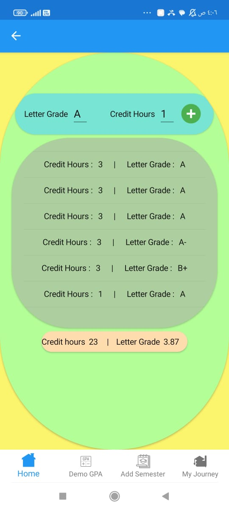
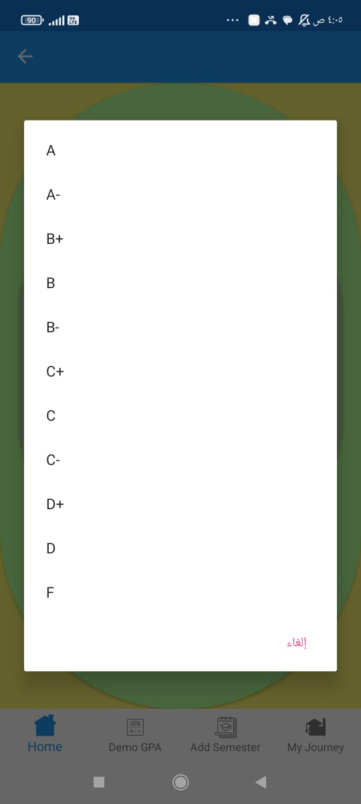
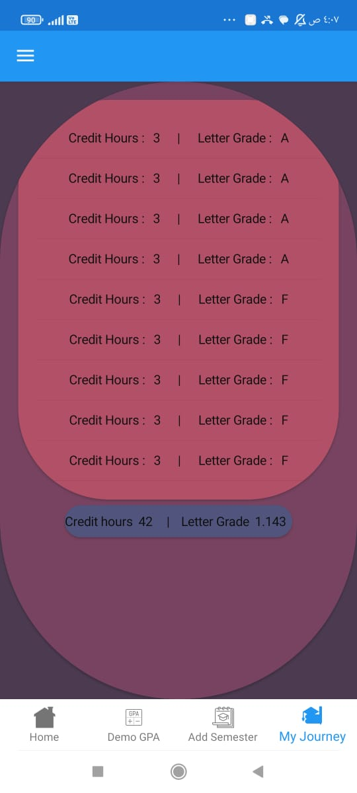
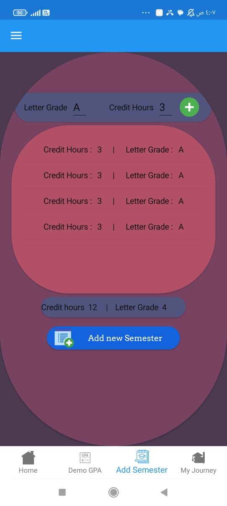

# GPA Calculator App

> A mobile application developed with Xamarin Forms for calculating GPA and managing academic records.

## Installation

To install and run the GPA Calculator App, follow these steps:

1. Clone the repository:
https://github.com/MohamedRagabAbbas/GPA-Calculator.git

2. Open the project in Xamarin Studio or Visual Studio.

3. Build the project to restore NuGet packages and compile the code.

4. Deploy the app to an emulator or physical device.

## Usage

1. Upon launching the app, you will be presented with the main screen.

2. To calculate your GPA:

- Enter the grade and credit hours for each course.
- Tap the "Add Course" button to include additional courses.
- The app will automatically calculate your GPA based on the provided information.

3. To manage your academic journey:

- Navigate to the "Semesters" section.
- Tap the "Add Semester" button to create a new semester.
- Enter the semester name, start and end dates, and any additional details.
- Save the semester to store it in the local database.

4. To view your saved GPA records and semesters:

- Access the "Saved Records" section.
- Here, you can view your previous GPA calculations and related semester information.

## Features

- Calculate GPA based on grades and credit hours.
- Add multiple courses and calculate cumulative GPA.
- Create and manage semesters with start and end dates.
- Store GPA records and semester information in a local database.

## Contributing

Contributions to the GPA Calculator App are welcome! If you'd like to contribute, please follow these guidelines:

1. Fork the repository.
2. Create a new branch for your feature or bug fix.
3. Make your modifications and ensure the code follows the project's coding conventions.
4. Test your changes thoroughly.
5. Commit your changes and push them to your forked repository.
6. Open a pull request, describing the purpose and changes of your contribution.

